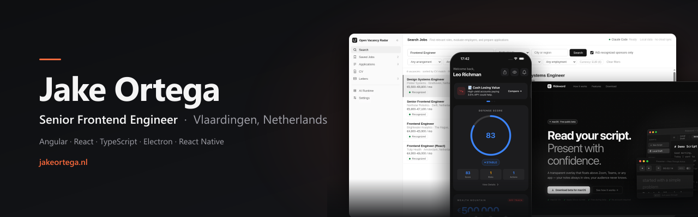
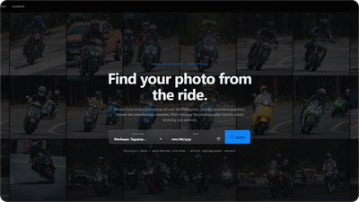
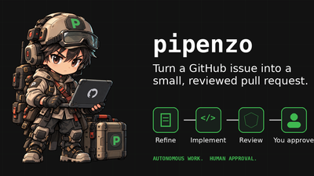
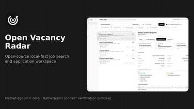
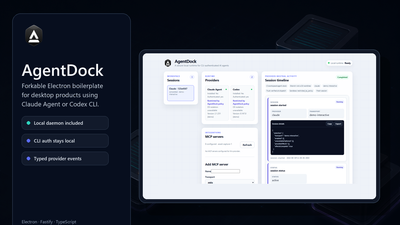
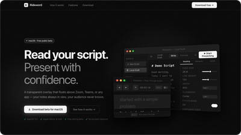
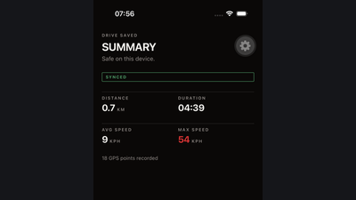
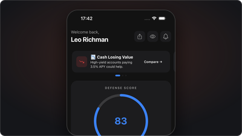
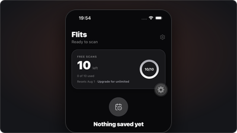

Senior Frontend Engineer, Vlaardingen, Netherlands.

[Portfolio](https://jakeortega.nl) · [Writing](https://jakeortega.nl/blog) · [LinkedIn](https://www.linkedin.com/in/ortegajake00/)

## Stack

## Things I've shipped

<table>
  <tr>
    <td width="240" valign="top"></td>
    <td valign="top"><b><a href="https://grabpitik.ph">GrabPitik</a></b>: search-first marketplace connecting motorcycle photographers and riders in the Philippines. Next.js, Prisma, PostgreSQL, Xendit.</td>
  </tr>
  <tr>
    <td width="240" valign="top"></td>
    <td valign="top"><b><a href="https://github.com/jortega0033/pipenzo">Pipenzo</a></b>: early, open source. Electron app, built on AgentDock, that turns a GitHub issue into a small, human-reviewable pull request through Claude Code or Codex, with a publish gate the agent can't call itself.</td>
  </tr>
  <tr>
    <td width="240" valign="top"></td>
    <td valign="top"><b><a href="https://github.com/jortega0033/open-vacancy-radar">Open Vacancy Radar</a></b>: local-first Electron app for discovering frontend vacancies and tracking applications. Netherlands roles verified against the IND's own sponsor register.</td>
  </tr>
  <tr>
    <td width="240" valign="top"></td>
    <td valign="top"><b><a href="https://github.com/jortega0033/agentdock">AgentDock</a></b>: open-source Electron and daemon boilerplate for desktop apps that run prompts through an already-authenticated Claude Code or Codex session, no API key involved. Backs Open Vacancy Radar and Pipenzo.</td>
  </tr>
  <tr>
    <td width="240" valign="top"></td>
    <td valign="top"><b><a href="https://rideword.app">Presentor</a></b>: macOS/Windows teleprompter overlay for developer demos and talks, backed by 594+ automated tests.</td>
  </tr>
  <tr>
    <td width="240" valign="top"></td>
    <td valign="top"><b><a href="https://github.com/jortega0033/road-pulse-ph">Revada</a></b>: in development. Mobile-first social driving app, capture and review drives with live GPS telemetry, share sessions with a crew, track leaderboards. React Native/Expo, TanStack Start, Firebase.</td>
  </tr>
  <tr>
    <td width="240" valign="top"></td>
    <td valign="top"><b><a href="https://dutchdefend.app">Dutch Defend</a></b>: financial-planning app for expats in the Netherlands, live on Google Play.</td>
  </tr>
  <tr>
    <td width="240" valign="top"></td>
    <td valign="top"><b><a href="https://getflits.app/">Flits</a></b>: screenshot-to-calendar app using a schema-validated Gemini vision pipeline, live on Google Play.</td>
  </tr>
</table>

More on [jakeortega.nl](https://jakeortega.nl).
